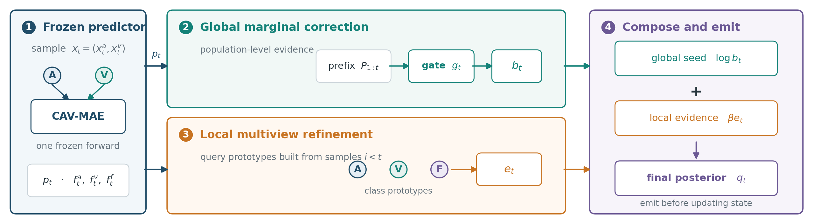

# FIRM: Frozen Inference via Rebalanced Marginals

Official implementation of **FIRM**, a backpropagation-free method for online
multimodal test-time adaptation under audio or video corruption.

FIRM freezes the audio-visual network and adapts only a lightweight causal
decision state. It combines:

1. **Gated marginal rebalancing**, which corrects persistent class-frequency
   collapse in the prediction prefix.
2. **Query-before-write multiview prototypes**, which conservatively refines
   each decision using audio, video, and fusion features from past samples.

No labels, corruption identities, damaged-modality annotations, gradients,
optimizer state, or network updates are used at test time.



## Results

Protocol-matched severity-5 results with CAV-MAE on all 15 video and 6 audio
corruption streams are shown below. Values are average top-1 accuracy (%).

| Dataset | Corrupted modality | Source | AdaPGC | FIRM | FIRM - AdaPGC |
|---|---|---:|---:|---:|---:|
| Kinetics50-C | Video | 60.487 | 66.853 | 66.832 | -0.021 |
| Kinetics50-C | Audio | 69.248 | 73.054 | 73.432 | +0.378 |
| VGGSound-C | Video | 56.035 | 57.295 | 58.296 | +1.001 |
| VGGSound-C | Audio | 25.057 | 37.283 | 40.118 | +2.835 |

On the same RTX 4090 protocol, FIRM used about 1 GB peak allocated GPU memory,
updated zero network parameters, and was 2.72--6.17x faster than AdaPGC in
end-to-end stream time. Exact speed depends on storage and data-loader speed.

## Repository layout

```text
firm/method.py          FIRM decision state
models/                 CAV-MAE backbone and feature extraction
run_firm.py             clean/single-corruption/all-corruption runner
scripts/run_all21.sh    two-dataset benchmark launcher
tools/summarize_results.py
configs/labels/         Kinetics50 and VGGSound class mappings
tests/                  CPU unit tests for the decision state
```

## Environment

The reported experiments used Python 3.12, PyTorch 2.5.1 + CUDA 12.4,
torchvision 0.20.1, torchaudio 2.5.1, and an RTX 4090.

```bash
conda create -n firm python=3.12 -y
conda activate firm
pip install torch==2.5.1 torchvision==0.20.1 torchaudio==2.5.1 \
  --index-url https://download.pytorch.org/whl/cu124
pip install -r requirements.txt
```

Alternatively:

```bash
conda env create -f environment.yml
conda activate firm
```

Verify the method-level tests without downloading a dataset or checkpoint:

```bash
pytest -q
```

## Data and checkpoints

Download the Kinetics50 and VGGSound benchmarks and corresponding CAV-MAE
source models from the official
[READ benchmark repository](https://github.com/XLearning-SCU/2024-ICLR-READ).
This repository does not redistribute datasets or model weights.

FIRM consumes the same JSON stream format as READ/AdaPGC. Each file contains a
`data` list, for example:

```json
{
  "data": [
    {
      "video_id": "sample_id",
      "wav": "/absolute/path/to/sample_id.wav",
      "video_path": "/absolute/path/to/image_frames",
      "labels": "class_mid"
    }
  ]
}
```

Expected layout:

```text
data/json/ks50/
  clean/severity_0.json
  video/<corruption>/severity_5.json
  audio/<corruption>/severity_5.json
data/json/vgg/
  clean/severity_0.json
  video/<corruption>/severity_5.json
  audio/<corruption>/severity_5.json
checkpoints/
  cav_mae_ks50.pth
  vgg_65.5.pth
```

The JSON files may live anywhere; pass their roots explicitly. Paths inside
the JSON files must point to the local audio and frame directories.

## Run one stream

Kinetics50-C with video Gaussian noise at severity 5:

```bash
python run_firm.py \
  --dataset ks50 \
  --json-root /path/to/json/ks50 \
  --label-csv configs/labels/class_labels_indices_ks50.csv \
  --checkpoint /path/to/cav_mae_ks50.pth \
  --gpu 0 --batch-size 8 --num-workers 8 \
  --corruption-modality video \
  --corruption gaussian_noise \
  --severity 5 \
  --output-dir outputs/ks50_video_gaussian_noise
```

`result.csv` reports Source, rebalancing-only, and full FIRM accuracy. Labels
are accessed only after FIRM emits a prediction and are used solely for metric
calculation.

## Run all streams

```bash
chmod +x scripts/run_all21.sh

JSON_KS50=/path/to/json/ks50 \
JSON_VGG=/path/to/json/vgg \
CHECKPOINT_KS50=/path/to/cav_mae_ks50.pth \
CHECKPOINT_VGG=/path/to/vgg_65.5.pth \
GPU=0 BATCH_SIZE=8 NUM_WORKERS=8 \
bash scripts/run_all21.sh
```

To run one dataset only, add `DATASETS=ks50` or `DATASETS=vggsound`.
Completed groups are skipped when their `result.csv` already exists.

## Protocol notes

- Stream order is sequential and deterministic.
- Decision state is reset at each clean/corruption stream boundary.
- The target prior is uniform, matching the approximately balanced benchmark
  protocol. FIRM is not intended as a general arbitrary-label-shift method.
- The released implementation retains the observed posterior prefix directly.
  It is lightweight for these finite benchmark streams but is not
  constant-memory for unbounded deployment.
- The feature-extraction micro-batch does not change the sample-causal FIRM
  update order.

## Citation

The paper citation will be added after publication. Until then, please cite
this repository using [`CITATION.cff`](CITATION.cff).

## Acknowledgements

This code builds on
[CAV-MAE](https://github.com/YuanGongND/cav-mae),
[READ](https://github.com/XLearning-SCU/2024-ICLR-READ), and
[AdaPGC](https://github.com/XLearning-SCU/AdaPGC).
We thank their authors for releasing code and benchmarks.

## License

Apache License 2.0. See [LICENSE](LICENSE) and [NOTICE](NOTICE).

